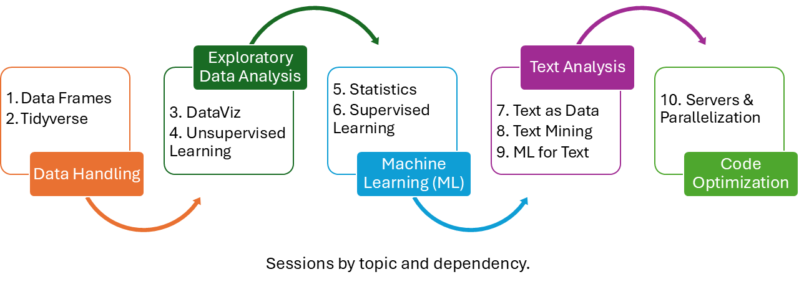

# R-workshop: R for Social Scientists

Welcome to the website of the “R for Social Scientists” workshop!

I designed this workshop series to give social scientists all that is
necessary to start using R in their everyday work.

The workshop is designed for academics in different career stages (from
PhD students to professors) and with different backgrounds. It does not
matter if you are a qualitative researcher that has never used R, or a
quantitative researcher that wants to learn new topics or move out of
SPSS/STATA. You all are welcome!

Please keep in mind that all the material builds on itself. If you are
interested on a specific topic, then you need to attend all the previous
sessions:

<figure id="id">

<figcaption aria-hidden="true">R-Workshop Build-up</figcaption>
</figure>

## Requirements

Students need to bring their own laptops.

Students need to have R and Rstudio installed.
