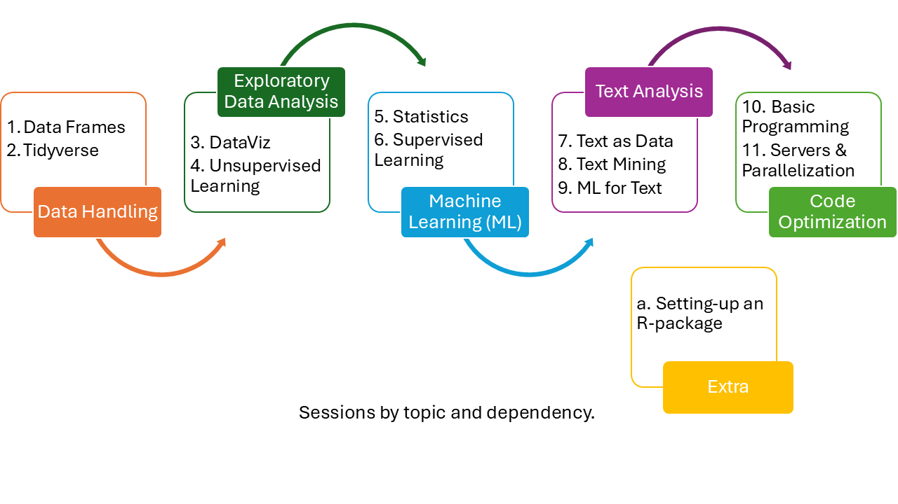

# R-Course: R for Social Scientists

Welcome to the website of the course “R for Social Scientists”!

I designed this course to give social scientists all that is
necessary to start using R in their everyday work.

The course is designed for academics in different career stages (from
PhD students to professors) and with different backgrounds. It does not
matter if you are a qualitative researcher that has never used R, or a
quantitative researcher that wants to learn new topics or move out of
SPSS/STATA. You all are welcome!

Please keep in mind that all the material builds on itself. If you are
interested on a specific topic, then you need to attend all the previous
sessions:

<figure id="id">

<figcaption aria-hidden="true">R-Workshop Build-up</figcaption>
</figure>

## Requirements

Students need to bring their own laptops.

Students need to have R and Rstudio installed.

## Did you find it useful? Then, do not forget to cite it
Gil-Clavel, S. (2025). R-Course: R for Social Scientists (Version 1.0) [Data set]. https://github.com/SofiaG1l/R_Course/. doi: https://doi.org/10.5281/zenodo.17184812.
